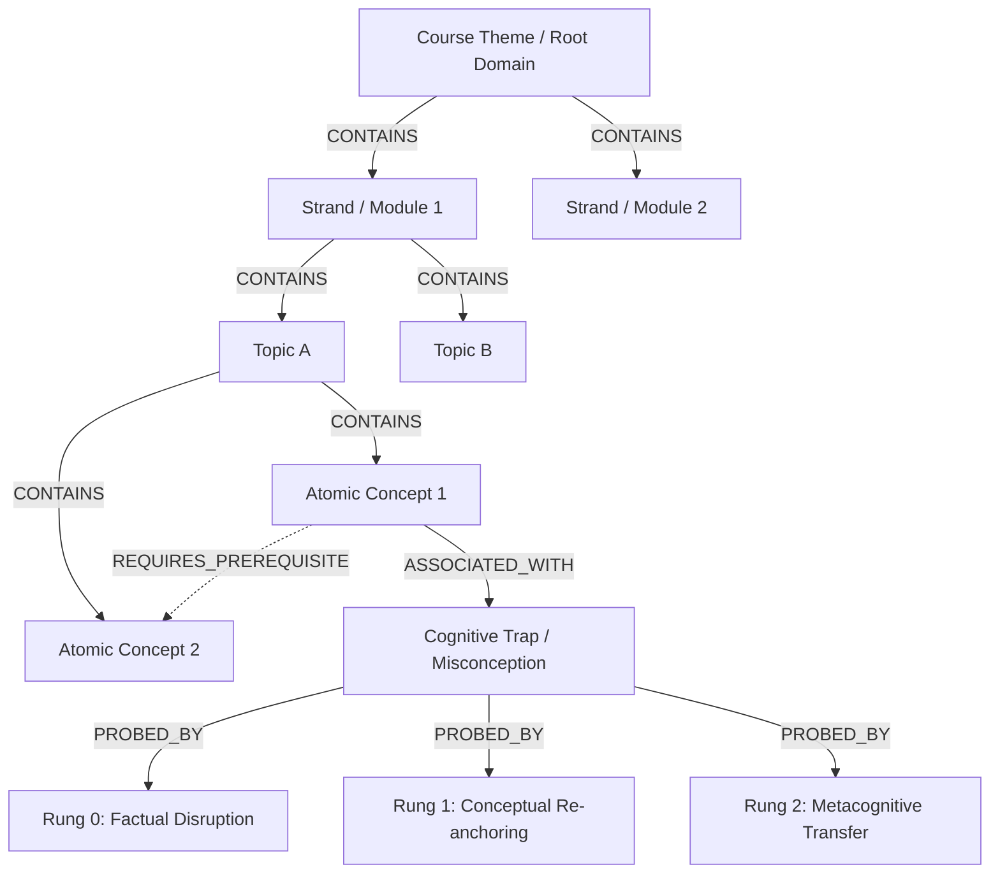

# Pedagogical Knowledge Graph Intermediate Representation (IR) Specification & Ingestion Pipeline

## 1. Executive Summary

Fiosra uses Neo4j to maintain a pedagogical knowledge graph comprising Knowledge Components (KCs), prerequisite DAG edges, cognitive misconceptions (traps), and 3-tier Socratic probes.

Historically, extracting these structures via small local models or piecemeal extraction led to:
1. **Low concept density and fragmentation**: Generic topics were extracted without granular atomic competencies.
2. **Missing cognitive traps**: Misconceptions were often absent or detached from specific subject-matter competencies.
3. **Inconsistent prerequisite structures**: Difficulties establishing DAG dependencies and module alignments.

To resolve this, we introduced the **Knowledge Graph Intermediate Representation (IR)**: a course-agnostic, schema-validated JSON format designed to allow frontier models (such as GPT-4o, Claude 3.5 Sonnet, or Gemini 1.5 Pro) to analyze full course texts and emit an end-to-end pedagogical knowledge graph in a single pass. This IR directly maps to Fiosra's `ConceptGraphProposal` Pydantic models and is hydrated into Neo4j via `ConceptGraphService.approve_proposal`.

---

## 2. Ontological Hierarchy & Semantics

The IR structures course knowledge into a 4-tier pedagogical tree augmented by diagnostic and prerequisite edges:



### Hierarchy Tiers (`level`)
1. **`course_theme`**: Single root node for the entire course (`parent_proposal_id: null`).
2. **`strand`**: Represents major modules, units, or chapters (`parent_proposal_id: course_theme`).
3. **`topic`**: Thematic areas, institutions, eras, frameworks, or phenomena under a strand.
4. **`atomic_concept`**: Learnable, testable granular competencies under a topic. Must specify a `bloom_level`.

### Ontological Primitives
- **Concept Types (`concept_type`)**:
  - `domain`: Broad subject area or field of study.
  - `entity`: Specific person, institution, text, artifact, place, organism, or theorem.
  - `process`: Transformation, mechanism, movement, procedure, or historical change.
  - `relationship`: Causal, comparative, or structural link.
  - `method`: Analytical, experimental, or problem-solving methodology.
  - `threshold`: Core gateway concept known to present learning bottlenecks.
- **Bloom Taxonomy (`bloom_level`)**:
  `remember` | `understand` | `apply` | `analyze` | `evaluate` | `create` (required on `atomic_concept`).
- **Misconceptions (`misconceptions`)**:
  Attached to atomic concepts. Includes:
  - `name`: Unique, descriptive title for the cognitive trap.
  - `flawed_rule`: The specific erroneous heuristic or misconception students hold.
  - `remediation_hint`: Concrete evidence, primary source, or rationale that refutes the trap.
- **Socratic Probes (`probes`)**:
  Triad of diagnostic probes attached to each misconception:
  - `rung 0` (Factual Disruption): Disrupts the false premise with concrete facts.
  - `rung 1` (Conceptual Re-anchoring): Re-aligns reasoning to the correct conceptual framework.
  - `rung 2` (Metacognitive Transfer): Tests transfer of reasoning to related scenarios.
- **Prerequisites (`prerequisites`)**:
  Directed dependency edges between atomic concepts enforcing a valid topological ordering (DAG) across or within modules.

---

## 3. JSON Schema Specification

The IR adheres directly to `fiosra.mvp.concepts.schemas.ConceptGraphProposal`.

```json
{
  "$schema": "http://json-schema.org/draft-07/schema#",
  "title": "ConceptGraphProposal",
  "type": "object",
  "required": ["course_rationale", "concepts", "prerequisites"],
  "properties": {
    "course_rationale": {
      "type": "string",
      "description": "Pedagogical rationale explaining how the graph models the course."
    },
    "concepts": {
      "type": "array",
      "items": {
        "type": "object",
        "required": [
          "proposal_id",
          "label",
          "definition",
          "concept_type",
          "level",
          "module_positions"
        ],
        "properties": {
          "proposal_id": { "type": "string", "example": "c1" },
          "label": { "type": "string", "maxLength": 160 },
          "definition": { "type": "string", "maxLength": 1200 },
          "concept_type": {
            "type": "string",
            "enum": ["domain", "entity", "process", "relationship", "method", "threshold"]
          },
          "level": {
            "type": "string",
            "enum": ["course_theme", "strand", "topic", "atomic_concept"]
          },
          "bloom_level": {
            "type": ["string", "null"],
            "enum": ["remember", "understand", "apply", "analyze", "evaluate", "create", null]
          },
          "parent_proposal_id": { "type": ["string", "null"] },
          "module_positions": {
            "type": "array",
            "items": { "type": "integer" }
          },
          "module_role": {
            "type": "string",
            "enum": ["introduces", "develops", "assesses"],
            "default": "introduces"
          },
          "misconceptions": {
            "type": "array",
            "items": {
              "type": "object",
              "required": ["name", "flawed_rule", "remediation_hint", "probes"],
              "properties": {
                "name": { "type": "string", "maxLength": 160 },
                "flawed_rule": { "type": "string" },
                "remediation_hint": { "type": "string" },
                "probes": {
                  "type": "array",
                  "items": {
                    "type": "object",
                    "required": ["rung", "probe_text", "rationale"],
                    "properties": {
                      "rung": { "type": "integer", "enum": [0, 1, 2] },
                      "probe_text": { "type": "string" },
                      "rationale": { "type": "string" }
                    }
                  }
                }
              }
            }
          }
        }
      }
    },
    "prerequisites": {
      "type": "array",
      "items": {
        "type": "object",
        "required": ["prerequisite_proposal_id", "dependent_proposal_id", "rationale"],
        "properties": {
          "prerequisite_proposal_id": { "type": "string" },
          "dependent_proposal_id": { "type": "string" },
          "rationale": { "type": "string" }
        }
      }
    }
  }
}
```

---

## 4. Course-Agnostic Generation Prompt

To generate a valid IR from any syllabus or curriculum document, submit the course document to a frontier LLM with the following system instruction:

```markdown
You are an expert curriculum knowledge engineer. Analyze the attached course material thoroughly and extract a COMPLETE pedagogical knowledge graph capturing every concept, theme, entity, process, and analytical competency present in the document.

OUTPUT: Respond with a single JSON object. No markdown formatting, no explanations — ONLY the valid JSON object adhering strictly to the schema below.

1. IDENTIFY COURSE STRUCTURE:
- Identify course title, domain, and numbered sequence of modules (1, 2, 3...).

2. EXTRACT CONCEPTS EXHAUSTIVELY:
Organize concepts into a 4-tier tree:
- course_theme: Single root node (parent_proposal_id: null).
- strand: One per module/chapter (parent_proposal_id: root course_theme id).
- topic: Major thematic areas, institutions, eras, frameworks under each strand.
- atomic_concept: Specific learnable competencies under each topic. Requires bloom_level.

3. CONCEPT TYPES:
"domain" | "entity" | "process" | "relationship" | "method" | "threshold"

4. BLOOM TAXONOMY:
"remember" | "understand" | "apply" | "analyze" | "evaluate" | "create" (only for atomic_concept).

5. MISCONCEPTIONS & PROBES:
For each atomic_concept, attach 1-2 subject-grounded misconceptions with unique names, explicit flawed_rule, and remediation_hint.
Each misconception must include 3 probes:
- Rung 0: Factual disruption
- Rung 1: Conceptual re-anchoring
- Rung 2: Metacognitive transfer

6. PREREQUISITES:
Define prerequisite edges between atomic_concepts where understanding A is necessary before B, with clear pedagogical rationale.
```

---

## 5. Ingestion Pipeline (`import_knowledge_graph.py`)

Ingesting the IR into Neo4j connects directly into the existing transaction pipeline:

1. **Validation**: The JSON file is parsed and validated against `ConceptGraphProposal`.
2. **Course Sync**: `ConceptGraphService.sync_course_structure(course)` creates `(:Course)` and `(:Module)` nodes in Neo4j and binds `COMPOSED_OF` relationships.
3. **Approval Execution**: `ConceptGraphService.approve_proposal(course, proposal)` is executed:
   - Merges `(:Concept:KnowledgeComponent)` nodes with labels, definitions, types, and Bloom levels.
   - Creates `(:Concept)-[:CONTAINS]->(:Concept)` parent-child structural edges.
   - Merges `(:Concept)-[:PREREQUISITE_OF]->(:Concept)` DAG edges.
   - Creates `(:Module)-[:INTRODUCES|DEVELOPS|ASSESSES]->(:Concept)` connections.
   - Creates `(:Misconception)` nodes with `[:ASSOCIATED_WITH]` edges to parent atomic concepts.
   - Creates `(:SocraticProbe)` nodes with `[:PROBED_BY]` relationships indexed by rung.
   - Evidences concepts against `(:SourceChunk)` nodes via BM25 / vector matching.

### CLI Execution

```bash
# Ingest local IR into Docker container
docker cp knowledge_graph_ir.json fiosra-app:/app/knowledge_graph_ir.json
docker cp import_knowledge_graph.py fiosra-app:/app/import_knowledge_graph.py

# Execute ingestion
docker exec fiosra-app python import_knowledge_graph.py knowledge_graph_ir.json <COURSE_ID>
```

---

## 6. Verification and UI Integration

Once imported, the graph is immediately accessible across Fiosra services:
- **Neo4j Cypher Verification**:
  ```cypher
  MATCH (course:Course {course_id: $course_id})-[:HAS_CONCEPT]->(c:Concept)
  OPTIONAL MATCH (c)-[:ASSOCIATED_WITH]->(m:Misconception)-[:PROBED_BY]->(p:SocraticProbe)
  RETURN count(DISTINCT c) AS concepts, count(DISTINCT m) AS misconceptions, count(DISTINCT p) AS probes
  ```
- **Fiosra Educator UI (`/ui/#/knowledge-graph`)**:
  - Live 2D/3D force-directed canvas displaying hierarchical clusters and prerequisite paths.
  - Node Inspector showing definitions, Bloom levels, associated cognitive traps, and 3-rung Socratic probes.
- **Socratic Dialogue Engine**:
  - The Socratic engine queries active misconception nodes during student reasoning sessions, dynamically serving laddered diagnostic probes when errors are detected.
