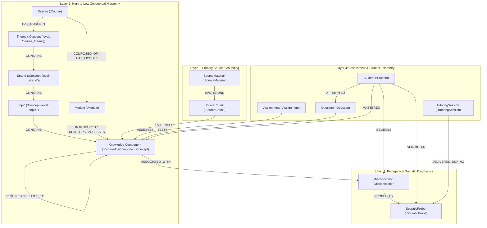

# Unified Curriculum & Pedagogical Taxonomy Reference

This document serves as the authoritative, definitive reference for the **Unified Curriculum & Pedagogical Taxonomy** across the Fiosra platform.

It documents the complete data contracts, property schemas, relationship semantics, Bloom’s taxonomy levels, Socratic inquiry rungs, and visual encodings implemented in Neo4j, PostgreSQL (pgvector), the Socratic Dialogue Engine, and the Obsidian Canvas Visualizer.

---

## 🧭 Architectural Overview & Metamodel

The taxonomy organizes educational knowledge into a **multi-tier, organic knowledge network** that bridges high-level curriculum design, granular primary source evidence, cognitive trap diagnostics, and learner mastery telemetry:



---

## 🏛️ Layer 1: High-to-Low Conceptual Hierarchy (`:Concept`)

Curriculum concepts are structured along a vertical hierarchy of instructional granularity and typed by their pedagogical function.

### 1. Concept Abstraction Levels (`ConceptLevel`)

| Level | Neo4j Value | Scope & Instructional Function | Concrete Example |
|---|---|---|---|
| **Course Theme** | `'course_theme'` | Overarching constitutional, historical, or intellectual core unifying the entire curriculum. | *"Early Modern Irish Constitutional and Agrarian Transformation"* |
| **Strand** | `'strand'` | Broad thematic pillar spanning across multiple modules or units. | *"Constitutional Sovereignty: Lordship to Kingdom"* |
| **Topic** | `'topic'` | Unit-level curriculum subject or focal point. | *"Surrender and Regrant Policy"* |
| **Subtopic** | `'subtopic'` | Intermediate conceptual subdivision within a topic. | *"Tanistry Elective Succession vs Feudal Law"* |
| **Atomic Concept** | `'atomic_concept'` | The granular competence target evaluated during student reasoning (`KnowledgeComponent`). | *"Primogeniture Disinheritance of Collateral Kinsmen"* |

### 2. Concept Functional Types (`ConceptType`)

| Type | Neo4j Value | Meaning | Typical Use Cases |
|---|---|---|---|
| **Domain** | `'domain'` | Broad disciplinary scope | High-level curriculum categorisation |
| **Entity** | `'entity'` | Institution, body, or landmark actor | *"East India Company"*, *"National Assembly"*, *"Crown Commissioners"* |
| **Process** | `'process'` | Dynamic evolution or movement over time | *"De-industrialization"*, *"Urbanization"*, *"Colonisation"* |
| **Relationship** | `'relationship'` | Structural dialectic or systemic tension | *"Brehon Clan Landholding vs English Feudal Tenure"* |
| **Policy** | `'policy'` | Statutory act, treaty, or formal doctrine | *"Crown of Ireland Act 1541"*, *"Treaty of Allahabad"*, *"Penal Laws"* |
| **Conflict** | `'conflict'` | Armed insurrection, crisis, or rebellion | *"Nine Years' War"*, *"1641 Rebellion"*, *"1857 Uprising"* |
| **Method** | `'method'` | Historiographical critique or reasoning technique | *"Cartographic Survey as Fiscal Confiscation"*, *"Source Provenance Analysis"* |
| **Threshold** | `'threshold'` | Irreversible cognitive breakthrough concept | Essential conceptual portal required for advanced reasoning |
| **Misconception** | `'misconception'` | Cognitive trap or flawed mental model | Flawed historical reasoning (see Layer 2) |

### 3. Hierarchy Relationship: `[:CONTAINS]`
- **Contract**: `(parent:Concept)-[:CONTAINS]->(child:Concept)`
- Establishes strict vertical inheritance from `course_theme` $\to$ `strand` $\to$ `topic` $\to$ `atomic_concept`.

---

## 🧠 Layer 2: Pedagogical Socratic Diagnostics

This layer models the cognitive mechanisms of student understanding, misunderstandings, and diagnostic inquiry ladders.

### 1. `KnowledgeComponent` (`:KnowledgeComponent:Concept`)

A `KnowledgeComponent` is an atomic mastery target dual-labeled as `:Concept` for seamless visualizer and API integration.

#### Property Contract:
```typescript
interface KnowledgeComponent {
  kc_id: string;                 // Scoped primary key (e.g. 'KC_HIST_INDUS_URBAN_A8F2C1')
  concept_id: string;            // Alias to kc_id ensuring 100% backward compatibility
  label: string;                 // Human-readable title (e.g. 'Indus Valley Urban Planning')
  definition: string;            // Formal instructional definition
  bloom_level: BloomLevel;       // Cognitive demand (see Bloom scale below)
  level: 'atomic_concept';       // Concept hierarchy placement
  concept_type: 'pedagogical_kc';// Functional classification
  estimated_difficulty: number;  // Calibrated difficulty float (0.0=trivial, 1.0=mastery)
  source_excerpt: string;        // Verbatim supporting quote (>= 20 chars) from source chunk
  domain: string;                // Subject domain ('History', 'Language')
  course_id: string;             // Course boundary UUID
  module_id: string;             // Module boundary UUID
  status: 'approved' | 'pending_review'; // Educator review state
}
```

#### Bloom's Revised Taxonomy Scale (`bloom_level`):
1. `'remember'` — Recalling dates, statutory titles, actors, and isolated historical facts.
2. `'understand'` — Explaining causes, summarizing policies, interpreting textual meaning.
3. `'apply'` — Using a conceptual framework to analyze an unfamiliar primary document.
4. `'analyze'` — Distinguishing competing perspectives, structural causation vs individual motive.
5. `'evaluate'` — Critiquing source bias, assessing the validity of historiographical interpretations.
6. `'create'` — Formulating an original, evidence-backed historical argument or essay.

**Visual Encoding**: Glowing Horizon Cyan (`#38bdf8`), radius scaled dynamically by degree centrality in the Obsidian D3-force simulation.

---

### 2. `Misconception` (`:Misconception`)

A `Misconception` represents an identifiable, recurrent cognitive trap, flawed mental model, or historical fallacy.

#### Property Contract:
```typescript
interface Misconception {
  misconception_id: string;      // Scoped primary key (e.g. 'MISC_HIST_MONOLITHIC_4D9E2A')
  kc_id: string;                 // Parent Knowledge Component reference
  course_id: string;             // Course boundary UUID
  module_id: string;             // Module boundary UUID
  name: string;                  // Short descriptive name (e.g. 'Monolithic Causation Fallacy')
  flawed_rule: string;           // The erroneous reasoning rule the student applies
  remediation_hint: string;      // Socratic pedagogical guidance for the tutor
  severity: 'foundational' | 'moderate' | 'advanced'; // Criticality to progression
  common_trigger: string;        // Task or prompt context that provokes the error
  example_student_error: string; // Verbatim quote of a typical student mistake
  example_correct_response: string; // Target nuanced reasoning
  status: 'approved' | 'pending_review';
}
```

**Visual Encoding**: Pulsing Amber (`#f59e0b`), animated warning ring in the Obsidian D3-force canvas.

---

### 3. `SocraticProbe` (`:SocraticProbe`)

A `SocraticProbe` is a diagnostic question designed to expose and remediate a specific misconception without disclosing direct answers (Answer Isolation).

#### Property Contract:
```typescript
interface SocraticProbe {
  probe_id: string;              // Scoped primary key (e.g. 'PROBE_HIST_M1_R0_1F8A9B')
  misconception_id: string;      // Parent Misconception reference
  kc_id: string;                 // Parent Knowledge Component reference
  course_id: string;             // Course boundary UUID
  module_id: string;             // Module boundary UUID
  rung: 0 | 1 | 2;               // Scaffolding ladder level (see below)
  probe_text: string;            // The verbatim question delivered by the Dialogue Engine
  rationale: string;             // Pedagogical justification for this probe
  status: 'approved' | 'pending_review';
}
```

#### The 3-Rung Socratic Inquiry Ladder:
* **Rung 0 (Metacognitive Reflection):**
  - *Goal*: Prompts the student to reflect on their own unstated premise.
  - *Example*: *"Before evaluating the outcome, what assumptions are you making about who had the authority to issue this decree?"*
* **Rung 1 (Conceptual Confrontation):**
  - *Goal*: Directs student attention to specific contrary evidence in the primary source.
  - *Example*: *"Look at Section 3 of the Despatches: how does St. Leger describe the subordinate kinsmen's reaction to the new patents?"*
* **Rung 2 (Evaluative Synthesis):**
  - *Goal*: Guides the student to synthesize evidence and formulate a revised, nuanced thesis.
  - *Example*: *"How can you restate your argument so that it accounts for both the chieftains' hereditary titles and the disinheritance of the clan?"*

**Visual Encoding**: Amethyst Purple (`#c084fc`), satellite-sized orbiting nodes in the canvas.

---

## 📚 Layer 3: Curriculum Progression & Source Grounding

### 1. Module-to-Concept Instructional Roles

Curriculum progression is tracked through typed relationships connecting `:Module` to `:Concept`:

| Relationship | Meaning | Student Experience |
|---|---|---|
| `(:Module)-[:INTRODUCES]->(:Concept)` | Foundational introduction | Initial encounter with concepts, terms, and context. |
| `(:Module)-[:DEVELOPS]->(:Concept)` | Deepening and application | Multi-source comparison, debate, and synthesis. |
| `(:Module)-[:ASSESSES]->(:Concept)` | Formal evaluation | Milestone reasoning assignments and rubrics. |

### 2. Relational Knowledge Network (Non-DAG)

Knowledge Components are interconnected in a **pure directed network graph**:

* **`(:KC)-[:REQUIRES {rationale: text}]->(:KC)`**:
  Directional mastery dependency indicating that understanding Concept A builds upon Concept B.
* **`(:KC)-[:RELATES_TO {rationale: text}]->(:KC)`**:
  Thematic, co-requisite, or reciprocal association.
* **Network Policy (Zero DAG Constraints)**:
  Per commit `bdd4d16`, **artificial cycle checks are prohibited**. Reciprocal and mutually reinforcing concepts (e.g. *Colonial Economic Policy* $\longleftrightarrow$ *De-industrialisation*) form valid cyclic loops that are traversed safely in Neo4j using bounded depth queries (`[:REQUIRES*1..3]`).

### 3. Primary Source Provenance

Every Knowledge Component is grounded in verifiable primary instructional materials:

* `(:SourceMaterial)-[:HAS_CHUNK]->(:SourceChunk)`: Deconstructs raw files into semantic sections.
* `(:SourceChunk)-[:EVIDENCES {method: 'verified_source_excerpt', excerpt: text, updated_at: datetime()}]->(:KnowledgeComponent)`:
  Anchors the concept directly to verbatim text passages.
* Physical chunk vectors are stored in PostgreSQL `syllabus_chunks` (1536-d `pgvector` embeddings) for sub-millisecond similarity lookups.

---

## 🎓 Layer 4: Assessment & Student Telemetry Layer

The taxonomy is actively consumed by and updated through live learner interactions:

| Cypher Pattern | Trigger / Event | Platform Action |
|---|---|---|
| `(:Assignment)-[:ASSESSES]->(:KC)` | Assignment Authoring | Bounds assignment rubrics and distractors to target KCs. |
| `(:Question)-[:TESTS]->(:KC)` | Question Authoring | Targets specific questions to individual competencies. |
| `(:Student)-[:ATTEMPTED]->(:Question)` | Student Submission | Logs attempt timestamps and student work. |
| `(:TutoringSession)-[:DELIVERED_DURING]->(:Probe)` | Socratic Turn | Records probe delivery to prevent repetitive questioning. |
| `(:Student)-[:BELIEVES]->(:Misconception)` | Cognitive Trap Flagged | Flagged when student language matches a flawed rule in dialogue. |
| `(:Student)-[:MASTERED]->(:KC)` | Demonstrated Mastery | Marked on verified mastery. **Automatically deletes** the `[:BELIEVES]` trap edge! |

---

## 🎨 Master Visual & Canvas Design Token Matrix

| Node / Edge Entity | Neo4j Label / Type | Canvas Hex Color | Visual Style |
|---|---|---|---|
| **Course** | `:Course` | Sapphire Blue `#2563eb` | Large anchor node |
| **Module** | `:Module` | Emerald Green `#10b981` | Hub-sized disc with glowing aura |
| **Knowledge Component** | `:KnowledgeComponent:Concept` | Horizon Cyan `#38bdf8` | Radius dynamically scaled by degree ($r \in [10, 26]$) |
| **Misconception** | `:Misconception` | Pulsing Amber `#f59e0b` | Medium disc with animated pulsing warning ring |
| **Socratic Probe** | `:SocraticProbe` | Amethyst Purple `#c084fc` | Satellite-sized orbiting leaf ($r = 8$) |
| **Contains Edge** | `[:CONTAINS]` | Subtle Slate `rgba(148, 163, 184, 0.25)` | Dotted structural line |
| **Prerequisite Edge** | `[:REQUIRES]` | Horizon Cyan `rgba(56, 189, 248, 0.40)` | Directed arrow with spring tension |
| **Association Edge** | `[:ASSOCIATED_WITH]` | Warning Amber `rgba(245, 158, 11, 0.45)` | Tension link pulling trap toward parent KC |
| **Probe Edge** | `[:PROBED_BY]` | Amethyst `rgba(192, 132, 252, 0.50)` | Orbital tether connecting probe to trap |
| **Evidence Edge** | `[:EVIDENCES]` | Subtle Emerald `rgba(16, 185, 129, 0.35)` | Grounding tether linking primary source chunk |

---

## 🔍 Canonical Cypher Traversal Queries

### 1. Retrieve the Full 4-Tier Course Knowledge Cosmos
```cypher
MATCH (course:Course {course_id: $course_id})
OPTIONAL MATCH (course)-[:HAS_CONCEPT]->(concept:Concept)
WHERE coalesce(concept.status, 'approved') <> 'superseded'

OPTIONAL MATCH (source:Concept {course_id: $course_id})-[edge:CONTAINS|REQUIRES|RELATES_TO]->(target:Concept {course_id: $course_id})
WHERE coalesce(source.status, 'approved') <> 'superseded' AND coalesce(target.status, 'approved') <> 'superseded'

OPTIONAL MATCH (module:Module {course_id: $course_id})-[module_edge:INTRODUCES|DEVELOPS|ASSESSES]->(linked:Concept {course_id: $course_id})
WHERE coalesce(linked.status, 'approved') <> 'superseded'

OPTIONAL MATCH (chunk:SourceChunk {course_id: $course_id})-[source_edge:EVIDENCES]->(evidenced:Concept)
WHERE coalesce(evidenced.status, 'approved') <> 'superseded'

OPTIONAL MATCH (k:KnowledgeComponent {course_id: $course_id})-[:ASSOCIATED_WITH]->(misc:Misconception)
WHERE coalesce(k.status, 'approved') <> 'superseded' AND coalesce(misc.status, 'approved') <> 'superseded'

OPTIONAL MATCH (misc)-[:PROBED_BY]->(p:SocraticProbe)
WHERE coalesce(p.status, 'approved') <> 'superseded'

RETURN course,
       collect(DISTINCT concept) AS concepts,
       collect(DISTINCT edge) AS edges,
       collect(DISTINCT module_edge) AS module_links,
       collect(DISTINCT source_edge) AS source_links,
       collect(DISTINCT misc) AS misconceptions,
       collect(DISTINCT p) AS probes;
```

### 2. Search Diagnosed Misconception & Retrieve Scaffolded Probes
```cypher
MATCH (k:KnowledgeComponent {kc_id: $kc_id})-[:ASSOCIATED_WITH]->(m:Misconception)
WHERE coalesce(m.status, 'approved') = 'approved'
  AND (toLower(m.name) CONTAINS toLower($query) 
       OR toLower(m.flawed_rule) CONTAINS toLower($query))
OPTIONAL MATCH (m)-[:PROBED_BY]->(p:SocraticProbe)
WHERE coalesce(p.status, 'approved') = 'approved'
RETURN m.misconception_id AS misconception_id,
       m.name AS name,
       m.flawed_rule AS flawed_rule,
       m.remediation_hint AS remediation_hint,
       collect(p { .probe_id, .rung, .probe_text, .rationale }) AS probes;
```

### 3. Record Student Demonstrated Mastery (Clear Active Cognitive Trap)
```cypher
MERGE (s:Student {student_id: $student_id})
MERGE (k:KnowledgeComponent {kc_id: $kc_id})
MERGE (s)-[r:MASTERED]->(k)
SET r.mastered_at = datetime()
WITH s
OPTIONAL MATCH (s)-[b:BELIEVES]->(m:Misconception {misconception_id: $cleared_misconception_id})
DELETE b;
```
