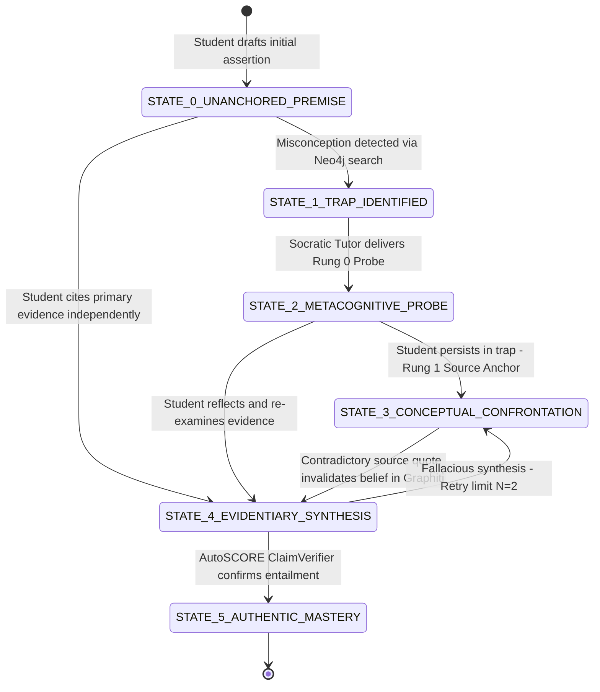

[← Back to Views Architecture Index](./README.md)

# 09. Deterministic Epistemic Policy Engine: Initial State $\to$ Ideal State

**Category**: Cognitive Architecture & Epistemic FSM  
**Primary Engine**: LangGraph Multi-Agent Engine (`socratic_tutor_graph`, `critic_agent`, `learner_evidence_agent`)  
**Data Substrate**: Neo4j Knowledge Graph (`:Misconception`, `:KnowledgeComponent`), Graphiti Bi-temporal Ledger (`valid_at`, `invalidated_at`), PostgreSQL EventStore  
**Primary Function**: Governs a student's cognitive transition from an ungrounded, flawed heuristic (**Initial State**) to authentic, evidence-anchored synthesis (**Ideal State**). Unlike probabilistic chat bots, this deterministic policy guarantees pedagogical safety, prevents answer leakage, tracks bi-temporal belief evolution, and enforces verifiable mastery.

---

## 1. Architectural Philosophy: The Cognitive State Machine

Traditional generative AI tutoring in LLM chat interfaces suffers from three fatal pedagogical flaws:
1. **Stochastic Leniency**: The tutor accepts superficially plausible or conversational answers without rigorous evidentiary verification.
2. **Answer Leakage**: The LLM prematurely provides synthesis, solutions, or leading answers under repeated student prompting.
3. **Ghostwriting Illusion**: Students learn to prompt the AI into writing paragraphs for them rather than experiencing genuine conceptual struggle.

Fiosra solves this by modeling student learning as a **Deterministic Finite State Machine (FSM)**:
$$\mathcal{M} = \langle S, \Sigma, \delta, s_0, F \rangle$$
Where:
- $S = \{ \text{STATE\_0}, \text{STATE\_1}, \text{STATE\_2}, \text{STATE\_3}, \text{STATE\_4}, \text{STATE\_5} \}$
- $\Sigma = \{ \text{draft\_claim}, \text{detect\_trap}, \text{probe\_metacognition}, \text{cite\_contradiction}, \text{synthesize\_evidence}, \text{verify\_entailment} \}$
- $\delta: S \times \Sigma \to S$ is the deterministic transition function verified by backend agents.
- $s_0 = \text{STATE\_0\_UNANCHORED\_PREMISE}$ (The student's initial intuitive hypothesis).
- $F = \{ \text{STATE\_5\_AUTHENTIC\_MASTERY} \}$ (The terminal state of verifiable evidentiary synthesis).

---

## 2. State Transition Diagram



---

## 3. Epistemic State Definitions & Transition Criteria

### `STATE_0: UNANCHORED_PREMISE` (Initial State)
- **Description**: The student's initial assertion or thesis drafted without citation, verification, or multi-causal weighing.
- **Cognitive Condition**: Intuitive bias, common-sense reasoning, or naive monocausal attribution (e.g., *"The French monarchy collapsed because Louis XVI was greedy and threw expensive parties"*).
- **Backend Action**:
  - PostgreSQL records `event: "claim_drafted"` with text offset.
  - Socratic Copilot remains quiet (quiet timer $T_{\text{quiet}} = 120\text{s}$) to allow independent formulation without premature interruption.

### `STATE_1: TRAP_IDENTIFIED`
- **Description**: The active claim matches a known flawed rule or misconception in Neo4j.
- **Detection Mechanism**:
  - `socratic_tutor_graph` performs semantic similarity search against `(:Misconception)` nodes linked to the target `(:KnowledgeComponent)`.
  - If similarity cosine $> 0.82$, triggers state transition to `STATE_1`.
- **Student Experience**: Non-disruptive. The Gemini UI copilot drawer displays a subtle indicator: *"Thinking with you..."*. No intrusive popups.
- **Teacher Visibility**: The student's node on the Cohort Radar (`#/studio/cohort`) shifts into the *Productive Struggle* quadrant.

### `STATE_2: METACOGNITIVE_PROBE` (Rung 0: Assumption Scaffolding)
- **Description**: Socratic Tutor delivers a metacognitive inquiry designed to prompt reflection on unstated premises.
- **Tutor Constraint**: Must **never** state that the student is wrong; must **never** introduce new historical/scientific facts not already present in the prompt.
- **Example Probe**:
  > *"You've identified royal expenditure as a key factor. What assumptions are you making about how the royal treasury was funded compared to modern national budgets?"*
- **Branching Transition**:
  - If the student recognizes the gap $\to$ Transitions directly to `STATE_4_EVIDENTIARY_SYNTHESIS`.
  - If the student doubles down on the flawed premise $\to$ Transitions to `STATE_3_CONCEPTUAL_CONFRONTATION`.

### `STATE_3: CONCEPTUAL_CONFRONTATION` (Rung 1: Primary Source Anchor)
- **Description**: Active cognitive dissonance. The tutor directs the student's attention to a specific primary source document that directly contradicts the flawed premise.
- **Bi-temporal Graphiti Invalidation**:
  - `learner_evidence_agent` captures the invalidation:
    ```json
    {
      "edge": "BELIEVES",
      "statement": "Royal luxury was the primary cause of 1788 bankruptcy",
      "status": "invalidated",
      "invalidated_at": "2026-09-17T22:24:10Z",
      "invalidating_evidence": "Exhibit A: Necker's Compte Rendu (1781)"
    }
    ```
- **Example Probe**:
  > *"Examine Table 3 in Necker's 1781 Compte Rendu (Exhibit A). What does Necker report regarding the ordinary budget surplus, and why were extraordinary war loans kept on a separate ledger?"*

### `STATE_4: EVIDENTIARY_SYNTHESIS` (Rung 2: Multi-Causal Nuance)
- **Description**: The student begins rewriting their canvas blocks to synthesize contradictory evidence into a nuanced, multi-causal thesis.
- **Verification Check**:
  - `critic_agent` and `learner_evidence_agent` run an entailment check:
    1. Does the revised text cite at least two exhibits?
    2. Does it link structural tax exemptions (`KC_HIST_FINANCE`) to the debt crisis?
    3. Does it acknowledge counter-arguments?
- **Deadlock Safeguard ($N=2$)**:
  - If the student attempts synthesis but commits a secondary fallacy more than twice ($N=2$), the policy flags the teacher console (`#/studio/interventions`) for a 1-click human intervention.

### `STATE_5: AUTHENTIC_MASTERY` (Ideal Terminal State)
- **Description**: The student's text fully entails the rubric dimensions for the assignment.
- **Verification**: `AutoSCORE` engine verifies that claims are logically entailed and substantiated by direct textual quotes.
- **Student Experience**: The Canvas workspace displays a green milestone badge: *"Evidentiary Mastery Achieved - Ready for Final Submission"*.
- **Post-Submission**: Locks document from further edits and compiles the immutable reflection dossier (`04_student_review_page.md`).

---

## 4. Formal Transition Matrix

| Current State ($S_t$) | Trigger Condition / Event ($\Sigma$) | Evaluator Agent | Target State ($S_{t+1}$) | Graphiti Mutation |
| :--- | :--- | :--- | :--- | :--- |
| `STATE_0` | Claim submitted; semantic similarity to `:Misconception` $< 0.50$ | `socratic_tutor_graph` | `STATE_4` | `valid_at = NOW()` |
| `STATE_0` | Claim submitted; semantic similarity to `:Misconception` $\ge 0.82$ | `socratic_tutor_graph` | `STATE_1` | Flag `:HAS_MISCONCEPTION` |
| `STATE_1` | Quiet timer expires or student asks for feedback | `critic_agent` | `STATE_2` | Emits `Rung 0` probe |
| `STATE_2` | Student persists in flawed premise | `learner_evidence_agent`| `STATE_3` | Emits `Rung 1` exhibit anchor |
| `STATE_2` | Student self-corrects premise with reasoning | `critic_agent` | `STATE_4` | Updates `confidence = 0.75` |
| `STATE_3` | Student quotes contradictory exhibit and revises claim | `learner_evidence_agent`| `STATE_4` | Sets `invalidated_at = NOW()` |
| `STATE_4` | Entailment check passes ($\ge 0.85$ confidence across KCs) | `text_claim_verifier` | `STATE_5` | Marks `STATUS: MASTERED` |
| `STATE_4` | Entailment fails; retry counter $< 2$ | `critic_agent` | `STATE_3` | Retains active state |
| `STATE_4` | Entailment fails; retry counter $\ge 2$ | `orchestrator` | `STATE_3` (Flagged)| Triggers Teacher Intervention |

---

## 5. Policy Invariants & Pedagogical Safeguards

1. **Answer-Isolation Guardrail (Zero Solution Leakage)**:
   - Every response generated by the Socratic Tutor must pass through `critic_agent`.
   - If the output contains direct synthesis sentences from the Answer Vault or reveals the target conclusion, the critic returns `pass: false` with score $< 0.85$, forcing the agent to reformulate into a question.
2. **Strict Monotonic Hint Ladder**:
   - Scaffolding rungs advance strictly monotonically ($0 \to 1 \to 2 \to 3$).
   - A student cannot "reset" hints or erase scaffolding usage from their permanent trace record.
3. **Authenticity Dwell Enforcement**:
   - A student cannot jump from `STATE_0` to `STATE_5` in $< 60\text{s}$ with a single copy-paste of a complete essay.
   - If an instant 500-word block is pasted, the policy holds the session in `STATE_4_EVIDENTIARY_SYNTHESIS` and prompts the student with an oral/written Socratic defense question to verify conceptual ownership.
4. **Teacher Sovereignty**:
   - An instructor can override the policy state at any time via the Intervention Station (`#/studio/interventions`), manually validating mastery or unlocking an advanced rung.
