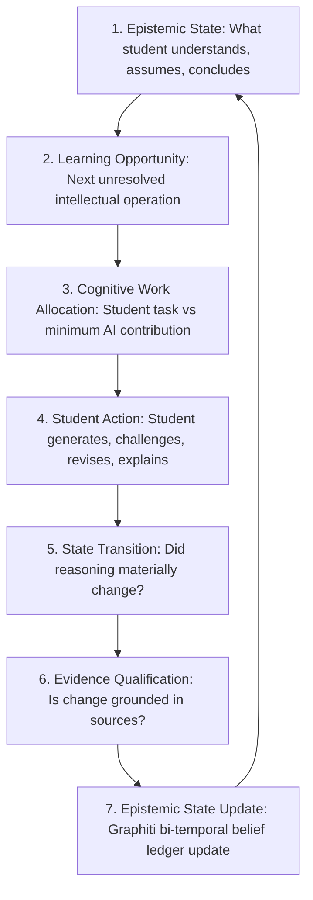

[← Back to Views Architecture Index](./README.md)

# 10. Epistemic Learning Loop & Socratic Marginalia Architecture

> ### 🎯 Core Product Vision (Deepanand Saha Roy)
> *"A learning system that maintains an evidence-grounded epistemic state of a learner’s developing reasoning, detects meaningful state transitions, and dynamically allocates cognitive work between learner and AI through policy-constrained interventions, with subsequent student-authored changes feeding the state model.*
>
> *And in order to enable this, we create a learning loop:*
>
> 1. **Epistemic State**: *“What does the student currently understand, assume, question and conclude?”*
> 2. **Learning Opportunity**: *“What is the next unresolved intellectual operation?”*
> 3. **Cognitive Work Allocation**: *“What should the student do, and what is the minimum the AI needs to contribute?”*
> 4. **Student Action**: *“The student generates, challenges, connects, revises or explains.”*
> 5. **State Transition**: *“Did the student’s reasoning materially change?”*
> 6. **Evidence Qualification**: *“Is the change sufficiently grounded to support a developmental claim?”*
> 7. **Epistemic State Update**: *“What is now different?”*  
> *→ repeat.*
>
> *Also, Fiosra should deliberately preserve a small amount of intellectual difficulty when that difficulty is useful for learning. In other words, Fiosra should remove unnecessary cognitive load while preserving necessary cognitive work. All of this is grounded in current research on metacognition."*

---

## 1. Architectural Philosophy: The Epistemic Work Allocation Engine

In traditional AI tutoring prototypes, assistance is bolted onto a text editor as an external chat box or a simple unidirectional question generator:
```
[Canvas Editor] ──(debounced text)──► [Vector Search on Misconceptions] ──► [Post Question]
```

### Why This Fails the Vision:
1. **The "Chatbot with Sticky Notes" Anti-Pattern**: Treating marginalia as a simple comment feed reproduces student passivity.
2. **Lack of an Epistemic State Model**: Without formally tracking what the learner *assumes*, *warrants*, and *concludes* ([Toulmin Argumentation](https://en.wikipedia.org/wiki/Stephen_Toulmin#The_Toulmin_model_of_argument)), the system cannot distinguish superficial paraphrasing from a genuine conceptual leap.
3. **Static Cognitive Allocation**: Either the AI prompts without scaffolding (risking prompt paralysis), or supplies explanations (eliminating the productive struggle).

---

## 2. 🔄 The 7-Step Closed Epistemic Learning Loop

Fiosra models the student inquiry journey as a closed-loop **Epistemic Work Allocation Engine**:



---

## 3. 🧠 Socratic Marginalia: Capabilities Across All 7 Steps

| Step in Learning Loop | Learner Experience in Marginalia | Backend Mechanism & Data Contract |
| :--- | :--- | :--- |
| **1. Epistemic State** | • **Toulmin Decomposition**: Paragraphs parsed into Claims, Warrants, Evidence, and Implicit Assumptions.<br>• **Assumption Surfacing**: *"Implicit Premise: Royal luxury was the primary cause of 1788 bankruptcy."*<br>• **Interactive Assumption Chips**: `[Keep & Defend]`, `[Test in Sources]`, `[Concede & Invalidate]`.<br>• **Confidence Stance**: `[💡 Intuitive Hypothesis]`, `[⚖️ Provisional Argument]`, `[🛡️ Grounded Claim]`. | • `EpistemicStateParser`<br>• Graphiti active belief graph with `valid_at` timestamps. |
| **2. Learning Opportunity** | • Pinpoints the specific intellectual gap:<br>&nbsp;&nbsp;– *Missing Causal Warrant*<br>&nbsp;&nbsp;– *Unstated Assumption*<br>&nbsp;&nbsp;– *Contradicted by Primary Exhibit*<br>&nbsp;&nbsp;– *Overgeneralized Scope* | • Neo4j vector similarity search on `(:Misconception)` and target `(:KnowledgeComponent)`. |
| **3. Cognitive Work Allocation** | • **Desirable Difficulties (Bjork & Sweller)**: AI removes mechanical friction (finding citations in 50-page PDF) but preserves synthesis struggle (AI never writes the warrant).<br>• **Assistance Slider**:<br>&nbsp;&nbsp;– Level 0: Pure Socratic Inquiry<br>&nbsp;&nbsp;– Level 1: Primary Source Spotlight<br>&nbsp;&nbsp;– Level 2: Sentence Frame with student-completed causal link. | • `CognitiveWorkAllocator`<br>• Answer-Isolation Critic Gate (`leakage_score < 0.15`). |
| **4. Student Action** | • **Drag-and-Drop Evidence Anchoring**: Drop quotes directly into probe warrant slots.<br>• **Inline Revision Frame**: Highlighted sentence editing in canvas.<br>• **In-Margin Defense**: 1-sentence justification turn. | • Client `FiosraContextStore`<br>• Pinned block offset coordinate sync. |
| **5. State Transition** | • **Pseudo-Revision vs. Real Pivot**: Distinguishes superficial word changes from genuine causal model updates.<br>• Metacognitive steering when logic remains unchanged. | • Semantic diffing across Revision $R_k$ vs $R_{k-1}$ in `socratic_probe_service`. |
| **6. Evidence Qualification** | • **Entailment Verification**: Confirms that cited excerpt logically justifies the claim.<br>• Emits verified epistemic milestone badge. | • AutoSCORE ClaimVerifier<br>• PostgreSQL `event: "epistemic_pivot_captured"`. |
| **7. Epistemic State Update** | • **Graphiti Belief Ledger**: Invalidation of naive premise (`invalidated_at: timestamp`) and creation of grounded claim.<br>• **Trace Sync**: Verified branch added to Living Argument Tree (`🎓`). | • Bi-temporal edge updates in Graphiti<br>• Neo4j mastery milestone status. |

---

## 4. Enhanced Backend Architecture & Tri-Database Flow

```
[ProseMirror Canvas] ──(Paragraph Text, Offset, Dwell)──► [Epistemic State Parser]
                                                                  │
                                   ┌──────────────────────────────┴──────────────────────────────┐
                                   ▼                                                             ▼
                       [Graphiti Belief Ledger]                                      [Neo4j Ontology Graph]
                    • Active Claims & Warrants                                    • (:Misconception) Vector Index
                    • Implicit Assumptions                                        • (:KnowledgeComponent) Map
                    • valid_at Timestamps                                         • Prerequisite Graph
                                   │                                                             │
                                   └──────────────────────────────┬──────────────────────────────┘
                                                                  ▼
                                                      [Cognitive Work Allocator]
                                              • Desirable Difficulty Calculator (Bjork)
                                              • Sets Next Intellectual Operation
                                              • Adaptive Assistance Slider (Level 0..2)
                                                                  │
                                                                  ▼
                                                      [Answer-Isolation Critic]
                                              • Prohibits Ghostwriting (Score >= 0.85)
                                                                  │
                                                                  ▼
                                                   [PostgreSQL EventStore & Gutter]
                                              • Emits Paragraph-Anchored Probe Card
```

---

## 5. 📐 In-Situ Workbench Grid & Layout Invariants

The reasoning workspace enforces a strict **40% width harmonization** with mutual sidebar collapse to guarantee that the student's central synthesis canvas remains prominent and uncluttered:

```
┌──────────────────────────────────────────────────────────────────────────────────────────────────┐
│  ← All Courses  │  Course Map  │  ✍️ Reasoning Canvas (Active)                                    │
├─────────────────┬───────────────────────────────────────────────────────────────┬────────────────┤
│ 📋 📄           │ 📝 STRUCTURED REASONING CANVAS                                │ 🧠 🤖 🎓       │
│ Sources / Brief │                                                               │ Gutter Views   │
│ (48px Rail or   │ [Claim Block] 🏷️ #claim                                       │ (44px Rail or  │
│ 40% when open)  │ The collapse of the monarchy in 1788 was driven by structural │ 40% when open) │
│                 │ tax exemptions rather than royal extravagance...             │                │
│                 │                                                               │                │
│                 │ [Evidence Block] 🏷️ #evidence                                  │                │
│                 │ "Necker's ordinary budget concealed wartime debt..."          │                │
└─────────────────┴───────────────────────────────────────────────────────────────┴────────────────┘
```

| Viewport State | Left Column | Center Canvas | Right Column | Pedagogical Purpose |
| :--- | :--- | :--- | :--- | :--- |
| **Default / Drafting** | `48px` (Slim Rail) | `minmax(0, 1fr)` (~90%) | `44px` (Slim Rail) | Maximum focus on deep writing and synthesis |
| **Doc Reader Open** | `clamp(620px, 40vw, 780px)` (40%) | `minmax(0, 1fr)` (~60%) | `44px` (Slim Rail) | Side-by-side primary source inspection & citation |
| **Right Gutter Open** (Marginalia / Agent / Trace) | `48px` (Slim Rail) | `minmax(0, 1fr)` (~60%) | `clamp(620px, 40vw, 780px)` (40%) | Spacious Socratic dialogue & argument inspection |

---

## 6. 🔬 Grounding in Learning Sciences Literature

1. **Desirable Difficulties (Bjork & Bjork, 2011)**: Making tasks artificially frictionless impairs long-term retention and conceptual transfer. Fiosra preserves the struggle of causal synthesis while removing extraneous navigation friction.
2. **Cognitive Load Theory (Sweller, 1988, 2024)**: Placing inquiries in the right gutter adjacent to the targeted paragraph eliminates the gaze-shifting split-attention effect of external chatboxes.
3. **Metacognitive Monitoring & Regulation (Flavell, 1979; Schraw, 1998)**: Assumption exposure and confidence tagging prompt learners to evaluate *how* they know what they claim to know.
4. **Zone of Proximal Development & Dynamic Fading (Vygotsky, 1978; Wood et al., 1976)**: The adaptive assistance slider fades AI scaffolding as learner reasoning matures toward self-directed evidence grounding.
