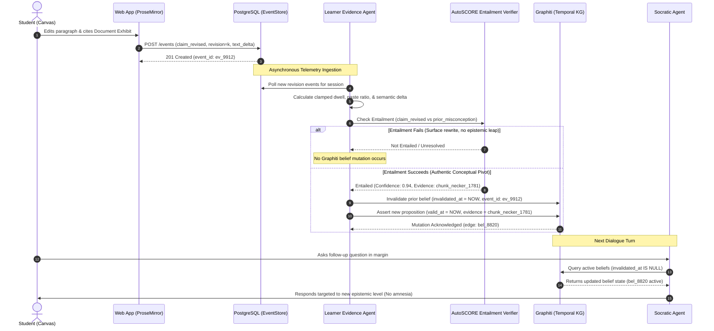

[← Back to Views Architecture Index](./README.md)

# 11. Epistemic Trace Architecture: Student & Teacher Experiences (Student-Level, Cohort-Level & Backend Engine)

> ### 🎯 Core Product Vision (Deepanand Saha Roy)
> *"A learning system that maintains an evidence-grounded epistemic state of a learner’s developing reasoning, detects meaningful state transitions, and dynamically allocates cognitive work between learner and AI through policy-constrained interventions, with subsequent student-authored changes feeding the state model.*
>
> *And in order to enable this, we create a learning loop: Epistemic State → Learning Opportunity → Cognitive Work Allocation → Student Action → State Transition → Evidence Qualification → Epistemic State Update → repeat.*
>
> *Fiosra should deliberately preserve a small amount of intellectual difficulty when that difficulty is useful for learning... remove unnecessary cognitive load while preserving necessary cognitive work."*

---

## 1. Architectural Philosophy: The Trace as a Living Epistemic Ledger

Traditional Learning Management Systems (LMS) treat student telemetry as a **post-hoc audit log**—recording binary outcomes: submission time, word count, multiple-choice scores, and plagiarism similarity percentages.

### Why Traditional Telemetry Fails:
1. **Blindness to Cognitive Process**: The educator sees the final essay, but cannot see *how* the student arrived there (Was it autonomous synthesis, prompt-engineering an LLM, or authentic self-correction?).
2. **Missing Metacognitive Feedback for Students**: Students receive a grade weeks later without an interactive record of their own mental transitions.
3. **No Early-Warning Intervention**: Educators only discover class-wide misconceptions after grading exams, long past the pedagogical moment of intervention.

### The Fiosra Epistemic Trace:
In Fiosra, the **Epistemic Trace** is a **continuous, bi-temporal epistemic flight recorder**. It records every premise formulation, evidence attachment, Socratic confrontation, belief invalidation, and cognitive pivot across the assignment lifecycle.

```
STUDENT WRITING ATTEMPT
(Keystrokes, Dwell, Highlights, Revisions)
                 │
                 ▼
┌────────────────────────────────────────────────────────┐
│             THE EPISTEMIC TRACE ENGINE                 │
│  • PostgreSQL: Append-only event log (Revisions)       │
│  • Graphiti: Bi-temporal belief graph (valid_at)       │
│  • Neo4j: Knowledge component & misconception mapping  │
└────────────────────────────────────────────────────────┘
                 │
       ┌─────────┴─────────┐
       ▼                   ▼
[STUDENT EXPERIENCES]    [TEACHER EXPERIENCES]
• Living Argument Tree   • Student Flight Recorder (60s Scrubber)
• Reflection Dossier     • Cohort Diagnostic Radar (4-Quadrant)
• Self-Correction Diff   • Misconception Cluster Broadcast
```

---

## 2. 🎓 The Ideal Student Experience

The Epistemic Trace manifests for the student across two temporal phases: **In-Situ (during writing)** and **Post-Submission (reflection dossier)**.

### A. In-Situ Reasoning Trace (During the Assignment)
Integrated into the right workbench sidebar as the **`🎓 Trace` tab** (occupying 40% width alongside the canvas):

1. **The Living Argument Tree**:
   - A dynamic Toulmin graph generated in real time as the student writes:
     - **Green Hexagons**: Evidence-grounded Claims.
     - **Blue Ovals**: Attached primary source citations with exhibit badges (`Exhibit A: Necker 1781`).
     - **Amber Diamonds**: Active Causal Warrants connecting Evidence to Claims.
     - **Dashed Red Boxes**: Flagged unstated assumptions awaiting verification.
   - **Interactive Node Actions**:
     - `[Jump ↗]`: Smoothly scrolls the canvas to the corresponding paragraph.
     - `[Examine ⚡]`: Opens the focused Socratic probe in the Marginalia gutter.
     - `[Find Evidence 🔍]`: Highlights relevant source excerpts in the Document Reader.
2. **4-Tile Reasoning Health Dashboard**:
   - *Claims Drafted*: Total independent assertions formed.
   - *Evidence Grounded*: Percentage of claims substantiated by primary citations.
   - *Causal Warrants*: Verified explanatory bridges connecting data to conclusions.
   - *Unresolved Assumptions*: Premises identified by the epistemic parser that remain ungrounded.
3. **Rubric Readiness Self-Audit**:
   - A pre-submission checklist verifying quote authenticity, minimum Bloom taxonomy demand, and probe resolution.
   - The submission button remains disabled (`409 Conflict Guard`) until core cognitive invariants are satisfied.

### B. Post-Submission Reflection & Epistemic Dossier
Available upon submission (`#/student/review`, specified in `04_student_review_page.md`):

1. **Before / After Cognitive Diff (The Self-Correction Showcase)**:
   - When the student reviews their submission, they can click on key **Epistemic Pivots** to see their thinking transform:
     - *Draft 1 (10:04 AM)*: `"The monarchy fell because Louis XVI spent all national revenues on Versailles luxury."`
     - *Contradiction Encountered*: Confronted with Exhibit A (Necker's ordinary budget surplus).
     - *Draft 3 (10:28 AM)*: `"While court spending caused public resentment, the monarchy collapsed because unserviced American War debt overwhelmed ordinary revenues, and structural tax immunities prevented systemic fiscal reform."`
2. **Demonstrated Competency Badges**:
   - Grounded badges showing verified mastery of target Knowledge Components (`KC_HIST_FINANCE`, `KC_HIST_CAUSATION`).
3. **Verbatim Evidence Dossier**:
   - Every citation is hyperlinked to the exact original page and paragraph in the assigned historical documents.

---

## 3. 🧑‍🏫 The Ideal Teacher Experience: Student-Level (Epistemic Flight Recorder)

**Route**: `#/studio/trace?session_id={id}` (Specified in `05_teacher_trace_student_level.md`)

```
┌────────────────────────────────────────────────────────────────────────────────────────────────────────┐
│ FIOSRA TEACHER STUDIO > Student Trace: Clara V. (HIST-201)             [Back to Cohort] [Intervene ⚡] │
├────────────────────────────────────────────────────────────────────────────────────────────────────────┤
│ ⏱️ REASONING SCRUBBER (Active Dwell: 34m 12s • Turns: 4 • Authenticity: 96% • State: STATE_5_MASTERY)  │
│ [0m: Start]───────[12m: Pivot 1]──────────────[24m: Turn 3]──────────────[36m: Rev 14]────[38m: Submit]│
│      ▲                   ▲                           ▲                         ▲              ▲        │
│   Anchored         Invalidated                 Corroborated                Pasted Text    Submitted    │
│   Royal Debt       Monarchy Spend              Exhibits A & B               Flag: 12 words (Verified)   │
├──────────────────────────────────────────────────────┬─────────────────────────────────────────────────┤
│ 🔍 COGNITIVE PIVOT INSPECTOR (Turn 2 / Minute 12)    │ 📊 TELEMETRY & AUTHENTICITY METRICS             │
├──────────────────────────────────────────────────────┼─────────────────────────────────────────────────┤
│ 🛑 BEFORE SOCRATIC PROBE (Draft Revision 4):         │ • Active Dwell Time: 34m 12s (Clamped)          │
│ "The royal government collapsed because the King was │ • Idle Distraction Periods: 2 (Total: 4m 10s)   │
│ spending too much on Versailles and luxury parties." │ • Keystroke Cadence: 54 WPM (Organic flow)      │
│                                                      │ • Paste Telemetry: 1 event (14 chars: verified) │
│ 🤖 SOCRATIC COPILOT PROBE:                           │ • Authenticity Confidence Score: 96%            │
│ "How does Necker's 1781 Compte Rendu (Exhibit A)     ├─────────────────────────────────────────────────┤
│ complicate this narrative regarding public solvency?"│ 🧬 GRAPHITI BI-TEMPORAL BELIEF EVOLUTION        │
│                                                      │                                                 │
│ ✅ AFTER SOCRATIC PROBE (Draft Revision 7):          │ ❌ INVALIDATED BELIEFS:                         │
│ "While royal spending caused resentment, Necker's    │ • Believes(RoyalExtravagance = PrimaryCause)    │
│ Compte Rendu masked structural debt from the         │   valid_at: 10:04 → invalidated_at: 10:16       │
│ American War, which archaic tax immunities prevented │                                                 │
│ the Crown from funding through ordinary revenue."    │ 🟢 ADOPTED & VERIFIED BELIEFS:                  │
│                                                      │ • Believes(TaxImmunity = StructuralCause)       │
│ 🎯 Epistemic Transition:                             │   valid_at: 10:16 → active                      │
│ STATE_1_CLAIM_ANCHORED → STATE_2_EVIDENCE_ATTACHED   │ • Believes(NeckerMaskedAmericanWarDebt)         │
│                                                      │   valid_at: 10:28 → active                      │
└──────────────────────────────────────────────────────┴─────────────────────────────────────────────────┘
```

### Key Teacher Capabilities (Under 60 Seconds Diagnostic):
1. **The 60-Second Micro-Timeline Scrubber**:
   - Scrubbing across the timeline time-travels the document view, allowing the educator to watch the essay evolve millisecond-by-millisecond.
2. **Cognitive Pivot Inspector**:
   - Automatically isolates the turning points where the student wrestled with cognitive dissonance and updated their mental model.
3. **Clamped Dwell vs. Idle Time Filtering**:
   - Filters out bathroom breaks, tab switches, and idle gaps ($>3\text{ min}$) to calculate **true authentic cognitive effort**.
4. **Authenticity & Provenance Heatmap**:
   - **Green**: Organically typed text with natural cadence and backspace edits.
   - **Blue**: Quoted directly from assigned primary exhibits.
   - **Red / Amber**: Pasted text (>150 characters in <500ms) without source matches—flags potential external ghostwriting.
5. **Direct Intervention Action (`⚡ Intervene`)**:
   - One click launches the educator intervention station (`08_teacher_intervention_view.md`) to push a live Socratic probe or award rubric bonus points.

---

## 4. 👥 The Ideal Teacher Experience: Cohort-Level (Class Diagnostic Radar)

**Route**: `#/studio/cohort` (Specified in `06_teacher_trace_cohort_level.md`)

```
┌────────────────────────────────────────────────────────────────────────────────────────────────────────┐
│ FIOSRA TEACHER STUDIO > Cohort Radar: HIST-201 > French Fiscal Crisis    [Active Students: 42/48]       │
├────────────────────────────────────────────────────────────────────────────────────────────────────────┤
│ 🎯 4-QUADRANT COHORT TRIAGE MATRIX                                                                     │
│                                                                                                        │
│   Epistemic Mastery (State 0-5)                                                                        │
│   ▲                                                                                                    │
│ 5 │    [ASSISTED MASTERY]               │            [INDEPENDENT MASTERY]                             │
│   │    • 8 Students                     │            • 19 Students                                     │
│ 4 │    (High mastery, moderate effort)  │            (High authentic effort, deep citations)          │
│   │                                     │                                                              │
│ 3 │─────────────────────────────────────┼─────────────────────────────────────────────                 │
│   │    [DISENGAGED / ANOMALOUS]         │            [PRODUCTIVE STRUGGLE / AT-RISK] ⚠️                │
│ 2 │    • 3 Students                     │            • 12 Students                                     │
│   │    (🚩 Flagged: High paste volume)  │            (High dwell time, repeated misconception loop)    │
│ 1 │                                     │                                                              │
│ 0 └─────────────────────────────────────┴─────────────────────────────────────────────► Active Dwell   │
│   0m                                   20m                                           60m               │
├────────────────────────────────────────────────────────────────────────────────────────────────────────┤
│ ⚠️ DOMINANT COHORT MISCONCEPTIONS & REASONING BOTTLENECK CLUSTERS                                      │
│                                                                                                        │
│ ┌────────────────────────────────────────────────────────────────────────────────────────────────────┐ │
│ │ 🔴 Cluster 1: "Royal Extravagance as Primary Insolvency Cause" (16 Students Stuck)                 │ │
│ │ • Targeted KC: KC_HIST_FINANCE (Deficit Structuring) • Turn Plateau: Turn 2 (Rung 1)               │ │
│ │ • Affected: Alex M., Sarah K., David L., +13 others...                                            │ │
│ │ [View Cluster Trace]  [⚡ Broadcast Socratic Counter-Probe to Cluster]  [Schedule Prerequisite]   │ │
│ └────────────────────────────────────────────────────────────────────────────────────────────────────┘ │
│                                                                                                        │
│ ┌────────────────────────────────────────────────────────────────────────────────────────────────────┐ │
│ │ 🟡 Cluster 2: "Necker's Compte Rendu Mistaken for Genuine Surplus" (9 Students Stuck)              │ │
│ │ • Targeted KC: KC_HIST_EVIDENCE (Auditing Primary Accounting) • Turn Plateau: Turn 3 (Rung 2)      │ │
│ │ • Affected: Marcus T., Elena P., +7 others...                                                      │ │
│ │ [View Cluster Trace]  [⚡ Broadcast Socratic Counter-Probe to Cluster]                             │ │
│ └────────────────────────────────────────────────────────────────────────────────────────────────────┘ │
├────────────────────────────────────────────────────────────────────────────────────────────────────────┤
│ 📋 STUDENT ROSTER TRIAGE TABLE                                     [Export CSV] [Batch Intervene (0)]  │
│ Student Name   Status     Dwell Time   Pivots   Current State     Authenticity   Action                │
│ Clara V.       Submitted  38 min       2        STATE_5_MASTERY   96% (Organic)  [Inspect Trace]       │
│ David L.       Active 🟢  42 min       0        STATE_1_CLAIM     92% (Organic)  [⚡ Intervene]         │
│ Jason B.       Submitted   6 min       0        STATE_3_COUNTER   18% (🚩 Paste) [Flag for Review]     │
└────────────────────────────────────────────────────────────────────────────────────────────────────────┘
```

### Key Cohort Diagnostic Tools:
1. **The 4-Quadrant Diagnostic Matrix**:
   - **X-axis**: Active Dwell Time (clamped cognitive effort).
   - **Y-axis**: Epistemic Mastery State (State 0: Unanchored Premise $\to$ State 5: Authentic Mastery).
   - Instantly segments a 100-student lecture hall into four actionable cohorts:
     - **Quadrant 1 (Independent Mastery)**: Ready for advanced extension or peer-review.
     - **Quadrant 2 (Productive Struggle)**: High dwell, engaging with Socratic inquiries. **Educator guideline: Let them struggle productively!**
     - **Quadrant 3 (At-Risk / Floundering)**: High dwell, zero pivots, repeated probe deferrals. Needs immediate 1-on-1 pedagogical intervention.
     - **Quadrant 4 (Disengaged / Anomaly)**: Ultra-low dwell, fast completion, high paste frequency. Needs academic integrity audit.
2. **Misconception Clustering Engine**:
   - Dynamically clusters students who share the same active `(:Misconception)` node in Neo4j and un-invalidated belief edge in Graphiti.
3. **One-Click Cluster Broadcast**:
   - Enables the teacher to send a targeted Socratic counter-inquiry or supplemental primary source exhibit to all 16 students in Cluster 1 simultaneously.

---

## 5. ⚙️ Technical Backend Architecture

The Epistemic Trace is generated and aggregated by three coordinated backend subsystems:

```
                            CLIENT TELEMETRY STREAM
           (Keystrokes, Selections, Dwell, Probe Responses, Saves)
                                      │
                                      ▼
                        [POSTGRESQL EVENT STORE]
                   • Append-only "events" ledger
                   • Canonical document_blocks & revisions
                                      │
                                      ▼
                       [LEARNER EVIDENCE AGENT]
                 (Asynchronous Background Telemetry Engine)
                                      │
              ┌───────────────────────┴───────────────────────┐
              ▼                                               ▼
   [GRAPHITI TEMPORAL LEDGER]                       [NEO4J COHORT AGGREGATOR]
• Adds belief edges: (:Student)-[:BELIEVES]->     • Clustered Misconceptions
• Records valid_at / invalidated_at               • Knowledge Component Coverage
• Links invalidating evidence chunks              • Cohort Quadrant Scatter Plot
              │                                               │
              └───────────────────────┬───────────────────────┘
                                      ▼
                           [STUDIO REST & SSE API]
                    • GET /events/session/{id}/trace
                    • GET /analytics/cohort/{assignment_id}
                    • SSE /events/cohort/{assignment_id}/live
```

### A. The PostgreSQL EventStore Data Schema
Every user micro-action is recorded as an immutable event in the `events` table:
```sql
CREATE TABLE events (
    event_id UUID PRIMARY KEY DEFAULT gen_random_uuid(),
    session_id UUID NOT NULL REFERENCES sessions(id) ON DELETE CASCADE,
    student_id VARCHAR(64) NOT NULL,
    event_type VARCHAR(64) NOT NULL, -- 'claim_drafted', 'probe_offered', 'epistemic_pivot_captured', etc.
    payload JSONB NOT NULL,
    revision_number INT NOT NULL DEFAULT 0,
    client_timestamp TIMESTAMPTZ NOT NULL,
    created_at TIMESTAMPTZ NOT NULL DEFAULT NOW()
);

CREATE INDEX idx_events_session_rev ON events(session_id, revision_number);
CREATE INDEX idx_events_student_type ON events(student_id, event_type);
```

### B. Graphiti Bi-temporal Ledger Contract
```json
{
  "edge_id": "bel_8819",
  "subject_id": "student_clara_v",
  "relation": "BELIEVES",
  "statement": "Monarchy collapsed purely from royal extravagance",
  "target_misconception_id": "MISC_HIST_LUXURY",
  "valid_at": "2026-09-18T21:40:10Z",
  "invalidated_at": "2026-09-18T22:15:22Z",
  "invalidating_evidence_chunk": "chunk_necker_1781_p14",
  "superseded_by_proposition": "bel_8820"
}
```

### C. The Learner Evidence Agent (`learner_evidence_agent.py`)
Computes derived telemetry metrics on every snapshot:
1. **Clamped Active Dwell Time**:
   $$T_{\text{active}} = \sum_{i=1}^n \min(\Delta t_i, 180\text{ seconds})$$
   (Any period without typing, selection, or scrolling exceeding 3 minutes is clamped to prevent inflated dwell metrics).
2. **Authenticity Confidence Score**:
   $$S_{\text{auth}} = 1.0 - \left( \frac{\text{PastedChars}}{\text{TotalChars}} \cdot 0.6 + \mathbb{I}(\text{WPM} > 160) \cdot 0.4 \right)$$
3. **Epistemic Leap Count**:
   Total number of verified transitions where an active misconception in Graphiti was successfully invalidated by cited primary evidence.

### D. Temporal State Authority: Who Reads & Who Updates Graphiti?

A foundational architectural invariant in Fiosra is the separation between **epistemic observation** (reading state) and **epistemic mutation** (updating state). Both the **Socratic Agent** and the **Learner Evidence Agent** have access to the student's temporal state, but their access modes, permissions, and responsibilities are strictly decoupled.

#### 1. Read vs. Write Access Matrix

| Dimension | Socratic Agent (`socratic_agent.py`) | Learner Evidence Agent (`learner_evidence_agent.py`) | Educator Intervention Station (`studio/`) |
| :--- | :--- | :--- | :--- |
| **Read Access** | **Active Epistemic State** (`invalidated_at IS NULL`). Reads current beliefs, misconceptions, and anchored claims before generating a dialogue turn or in-situ probe. | **Full Temporal History** (`valid_at` through `invalidated_at`). Traverses the entire evolution tree to measure epistemic leaps, dwell distribution, and self-correction pivots. | **Cohort & Individual Aggregates**. Reads clustered misconceptions, quadrant placement, and flight recorder telemetry. |
| **Write Authority** | **NONE (Read-Only)**. The Socratic Agent cannot self-certify student mastery or directly mutate Graphiti edges. AI cannot grade or validate its own dialogue. | **EXCLUSIVE AUTOMATED MUTATOR**. Mutates Graphiti only after verifying authentic, qualified student-authored changes via the entailment pipeline. | **MANUAL OVERRIDE**. Teachers can explicitly certify mastery, clear persistent misconception flags, or insert pedagogical notes. |
| **Primary Purpose** | Prevent conversational amnesia; adapt challenge levels dynamically to the student's real-time ZPD. | Deterministically detect cognitive pivots, compute authenticity scores, and maintain the immutable epistemic trace. | High-leverage targeted interventions; orchestrating group socratic seminars. |

#### 2. Why the Socratic Agent Never Updates Belief State Directly (Zero AI Ghostwriting)

If the Socratic Agent were permitted to update belief states, a conversational turn where the AI offers an explanation or asks a leading question could prematurely register a misconception as "resolved." 

To preserve epistemic integrity:
1. **No Self-Attribution**: An AI agent cannot attest to a human's understanding simply because the AI articulated the correct reasoning.
2. **Action-Grounded Evidence**: Belief transitions in Graphiti require empirical proof in the student's primary work product (their thesis, paragraph revisions, or cited primary exhibits).
3. **Auditability**: Every mutated edge in Graphiti points back to an immutable `event_id` in the PostgreSQL event store representing an authentic student action.

#### 3. Mutation Pipeline: How Student Action Drives State Updates

Only student-authored actions can trigger Graphiti temporal mutations through the following asynchronous verification loop:



#### 4. The Authorized Mutation Pathways

1. **Canvas Prose & Citation Revision (Primary Pathway)**:
   - When a student modifies their text in ProseMirror or attaches an exhibit excerpt, `LearnerEvidenceAgent` analyzes Revision $R_k$ against Revision $R_{k-1}$.
   - If the student incorporates contradictory evidence that refutes an active misconception, the previous belief edge is closed (`invalidated_at = NOW`) and the refined proposition is instantiated.
2. **In-Situ Probe Defense (Secondary Pathway)**:
   - When a student responds to a marginalia probe (e.g., answering *"How do you reconcile Necker's 1781 ordinary surplus with royal extravagance?"*), the defense is scored against rubric criteria.
   - A logically sound defense with exhibit linkage triggers a transition from `STATE_2_INQUIRY` to `STATE_4_DEFENSE` in Graphiti.
3. **Epistemic Action Capsule Commit (Macro-Dialogue Pathway)**:
   - During sidebar Socratic dialogue, when a breakthrough occurs, the agent presents a single-action capsule: `[Transfer Refined Claim to Paragraph 2]`.
   - Clicking the capsule pastes the student's formulated reasoning into the document canvas as a student-stamped edit, which then flows through the standard Canvas Revision pipeline.
4. **Educator Studio Intervention (Administrative Override Pathway)**:
   - In `#/studio/interventions`, an instructor observing a live session can click `[Mark Concept Mastered]` or `[Re-open Inquiry]`.
   - This records an `educator_intervention` event in PostgreSQL and updates Graphiti with `asserted_by: "educator:<id>"`.

---

## 6. 📡 API Endpoints & Request / Response Contracts

### 1. `GET /events/session/{session_id}/trace`
Retrieves the complete flight recorder history for an individual student attempt:
```json
{
  "session_id": "8f3b6154-1b4e-4f8e-a982-19e34e567890",
  "student_id": "student_clara_v",
  "total_active_dwell_seconds": 2052,
  "epistemic_state": "STATE_5_MASTERY",
  "authenticity_score": 0.96,
  "milestones": [
    {
      "timestamp": "2026-09-18T21:40:10Z",
      "type": "claim_anchored",
      "label": "Anchored Naive Premise",
      "text": "The monarchy collapsed because Louis XVI spent all money on Versailles."
    },
    {
      "timestamp": "2026-09-18T22:15:22Z",
      "type": "epistemic_pivot",
      "label": "Cognitive Pivot (Turn 2)",
      "before_text": "The monarchy collapsed because Louis XVI spent all money on Versailles.",
      "after_text": "While court spending caused resentment, unserviced war debt overwhelmed ordinary revenue...",
      "invalidated_belief": "Royal luxury was the primary insolvency cause",
      "grounding_source_id": "src_necker_1781"
    }
  ]
}
```

### 2. `GET /analytics/cohort/{assignment_id}`
Returns the 4-quadrant diagnostic scatter plot and misconception clusters for the teacher studio:
```json
{
  "assignment_id": "331e8406-4af3-433a-997a-dee35305fe43",
  "active_students": 42,
  "total_enrolled": 48,
  "quadrant_counts": {
    "independent_mastery": 19,
    "assisted_mastery": 8,
    "productive_struggle": 12,
    "anomalous_disengaged": 3
  },
  "misconception_clusters": [
    {
      "cluster_id": "cluster_luxury_myth",
      "misconception_name": "Royal Extravagance as Primary Insolvency Cause",
      "target_kc": "KC_HIST_FINANCE",
      "affected_students_count": 16,
      "student_ids": ["student_alex", "student_sarah", "student_david"],
      "recommended_counter_probe": "How does Necker's 1781 ordinary budget table challenge the premise of direct royal deficit?"
    }
  ]
}
```

---

## 7. 🔒 Pedagogical Safeguards & Data Invariants

1. **Answer Isolation in Trace**: The trace only records student-generated reasoning and Socratic inquiries. Ground-truth teacher answer keys are never stored in or leaked through the trace pipeline.
2. **Deterministic Attribution**: Every highlighted self-correction and rubric badge is verifiable back to a specific `event_id` in PostgreSQL. The AI never invents or hallucinates student progress.
3. **Non-Punitive Struggle**: High dwell time and multiple Socratic turns are categorized as **Productive Struggle**, not penalized. Fiosra values genuine cognitive struggle over rapid, unreflective completion.
