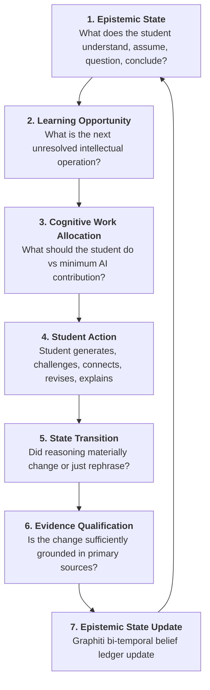

# Fiosra View Architecture & Epistemic Learning Blueprint

> ### 🎯 Core Product Vision (Deepanand Saha Roy)
> *"A learning system that maintains an evidence-grounded epistemic state of a learner’s developing reasoning, detects meaningful state transitions, and dynamically allocates cognitive work between learner and AI through policy-constrained interventions, with subsequent student-authored changes feeding the state model.*
>
> *And in order to enable this, we create a learning loop:*
>
> 1. **Epistemic State**: *“What does the student currently understand, assume, question and conclude?”*
> 2. **Learning Opportunity**: *“What is the next unresolved intellectual operation?”*
> 3. **Cognitive Work Allocation**: *“What should the student do, and what is the minimum the AI needs to contribute?”*
> 4. **Student Action**: *“The student generates, challenges, connects, revises or explains.”*
> 5. **State Transition**: *“Did the student’s reasoning materially change?”*
> 6. **Evidence Qualification**: *“Is the change sufficiently grounded to support a developmental claim?”*
> 7. **Epistemic State Update**: *“What is now different?”*  
> *→ repeat.*
>
> *Also, Fiosra should deliberately preserve a small amount of intellectual difficulty when that difficulty is useful for learning. In other words, Fiosra should remove unnecessary cognitive load while preserving necessary cognitive work. All of this is grounded in current research on metacognition."*

---

## 🔄 The 7-Step Closed Epistemic Learning Loop

Fiosra models the student reasoning journey not as an open-ended conversational chat, but as a closed-loop **Epistemic Work Allocation Engine**:



---

## 🧠 Socratic Marginalia: The Epistemic Work Allocation Engine

Socratic Marginalia is not a static list of AI comments or a sticky-note drawer. It is the primary **in-situ interface** where cognitive work is negotiated, unstated assumptions are surfaced, and authentic epistemic transitions are validated.

### 1. High-Level Architecture & Tri-Database Flow

```
[ProseMirror Canvas] ──(Paragraph Text, Offset, Dwell)──► [Epistemic State Parser]
                                                                  │
                                   ┌──────────────────────────────┴──────────────────────────────┐
                                   ▼                                                             ▼
                       [Graphiti Belief Ledger]                                      [Neo4j Ontology Graph]
                    • Active Claims & Warrants                                    • (:Misconception) Vector Index
                    • Implicit Assumptions                                        • (:KnowledgeComponent) Map
                    • valid_at Timestamps                                         • Prerequisite Graph
                                   │                                                             │
                                   └──────────────────────────────┬──────────────────────────────┘
                                                                  ▼
                                                      [Cognitive Work Allocator]
                                              • Desirable Difficulty Calculator (Bjork)
                                              • Sets Next Intellectual Operation
                                              • Adaptive Assistance Slider (Level 0..2)
                                                                  │
                                                                  ▼
                                                      [Answer-Isolation Critic]
                                              • Prohibits Ghostwriting (Score >= 0.85)
                                                                  │
                                                                  ▼
                                                   [PostgreSQL EventStore & Gutter]
                                              • Emits Paragraph-Anchored Probe Card
```

### 2. Operationalizing the 7 Steps in Marginalia

| Step in Learning Loop | Learner Experience in Marginalia | Backend Mechanism & Data Contract |
| :--- | :--- | :--- |
| **1. Epistemic State** | • **Toulmin Decomposition**: Paragraphs parsed into Claims, Warrants, Evidence, and Implicit Assumptions.<br>• **Assumption Surfacing**: *"Implicit Premise: Royal luxury caused national bankruptcy."*<br>• **Confidence Stance**: `[💡 Hypothesis]`, `[⚖️ Provisional]`, `[🛡️ Grounded Claim]`. | • `EpistemicStateParser`<br>• Graphiti active belief graph with `valid_at` timestamps. |
| **2. Learning Opportunity** | • Pinpoints the specific reasoning gap:<br>&nbsp;&nbsp;– *Missing Causal Warrant*<br>&nbsp;&nbsp;– *Unstated Assumption*<br>&nbsp;&nbsp;– *Contradicted by Exhibit A*<br>&nbsp;&nbsp;– *Overgeneralized Scope* | • Neo4j vector similarity search on `(:Misconception)` and target `(:KnowledgeComponent)`. |
| **3. Cognitive Work Allocation** | • **Desirable Difficulties (Bjork & Sweller)**: AI removes mechanical friction (finding excerpts in 50-page PDF) but preserves synthesis struggle (AI never writes the warrant).<br>• **Assistance Slider**:<br>&nbsp;&nbsp;– Level 0: Pure Socratic Inquiry<br>&nbsp;&nbsp;– Level 1: Primary Source Spotlight<br>&nbsp;&nbsp;– Level 2: Sentence Frame with student-completed causal link. | • `CognitiveWorkAllocator`<br>• Answer-Isolation Critic Gate (`leakage_score < 0.15`). |
| **4. Student Action** | • **Drag-and-Drop Evidence Anchoring**: Drop quotes directly into probe warrant slots.<br>• **Inline Revision Frame**: Highlighted sentence editing in canvas.<br>• **In-Margin Defense**: 1-sentence justification turn. | • Client `FiosraContextStore`<br>• Pinned block offset coordinate sync. |
| **5. State Transition** | • **Pseudo-Revision vs. Real Pivot**: Distinguishes superficial word changes from genuine causal model updates.<br>• Metacognitive steering when logic remains unchanged. | • Semantic diffing across Revision $R_k$ vs $R_{k-1}$ in `socratic_probe_service`. |
| **6. Evidence Qualification** | • **Entailment Verification**: Confirms that cited excerpt logically justifies the claim.<br>• Emits verified epistemic milestone badge. | • AutoSCORE ClaimVerifier<br>• PostgreSQL `event: "epistemic_pivot_captured"`. |
| **7. Epistemic State Update** | • **Graphiti Belief Ledger**: Invalidation of naive premise (`invalidated_at: timestamp`) and creation of grounded claim.<br>• **Trace Sync**: Verified branch added to Living Argument Tree (`🎓`). | • Bi-temporal edge updates in Graphiti<br>• Neo4j mastery milestone status. |

---

## 📐 In-Situ Workbench Grid & Layout Invariants

The reasoning workspace enforces a strict **40% width harmonization** with mutual sidebar collapse to guarantee that the student's central synthesis canvas remains prominent and uncluttered:

```
┌──────────────────────────────────────────────────────────────────────────────────────────────────┐
│  ← All Courses  │  Course Map  │  ✍️ Reasoning Canvas (Active)                                    │
├─────────────────┬───────────────────────────────────────────────────────────────┬────────────────┤
│ 📋 📄           │ 📝 STRUCTURED REASONING CANVAS                                │ 🧠 🤖 🎓       │
│ Sources / Brief │                                                               │ Gutter Views   │
│ (48px Rail or   │ [Claim Block] 🏷️ #claim                                       │ (44px Rail or  │
│ 40% when open)  │ The collapse of the monarchy in 1788 was driven by structural │ 40% when open) │
│                 │ tax exemptions rather than royal extravagance...             │                │
│                 │                                                               │                │
│                 │ [Evidence Block] 🏷️ #evidence                                  │                │
│                 │ "Necker's ordinary budget concealed wartime debt..."          │                │
└─────────────────┴───────────────────────────────────────────────────────────────┴────────────────┘
```

| Viewport State | Left Column | Center Canvas | Right Column | Pedagogical Purpose |
| :--- | :--- | :--- | :--- | :--- |
| **Default / Drafting** | `48px` (Slim Rail) | `minmax(0, 1fr)` (~90%) | `44px` (Slim Rail) | Maximum focus on deep writing and synthesis |
| **Doc Reader Open** | `clamp(620px, 40vw, 780px)` (40%) | `minmax(0, 1fr)` (~60%) | `44px` (Slim Rail) | Side-by-side primary source inspection & citation |
| **Right Gutter Open** (Marginalia / Agent / Trace) | `48px` (Slim Rail) | `minmax(0, 1fr)` (~60%) | `clamp(620px, 40vw, 780px)` (40%) | Spacious Socratic dialogue & argument inspection |

---

## 🗺️ View Map & Navigation Topology

```
                                  STUDENT ATTEMPT
                           (Keystrokes, Dwell, Claims)
                                         │
                 ┌───────────────────────┴───────────────────────┐
                 ▼                                               ▼
         [STUDENT VIEWS]                                  [TEACHER VIEWS]
  ┌─────────────────────────────┐                 ┌─────────────────────────────┐
  │ 01. Courses & Assignments   │                 │ 05. Student-Level Trace     │
  │     (Catalog & Enrolled)    │                 │     (Epistemic Recorder)    │
  │                             │                 │                             │
  │ 02. Assignment View         │                 │ 06. Cohort-Level Trace      │
  │     (Brief, Sources, KCs)   │                 │     (Class Radar & Triage)  │
  │                             │                 │                             │
  │ 03. In-Situ Workspace       │                 │ 07. Evaluation Window       │
  │     • Reasoning Canvas      │                 │     • Misconception Clusters│
  │     • Socratic Marginalia   │                 │     • Horizontal Grouping   │
  │     • Evidentiary Well      │                 │     • AutoSCORE Rubrics     │
  │                             │                 │                             │
  │ 04. Student Review Page     │                 │ 08. Intervention View       │
  │     (Reflection Dossier)    │                 │     • Seal Grade            │
  │     • Bi-temporal Timeline  │                 │     • Push Socratic Nudge   │
  │     • Self-Correction Diff  │                 │     • Prerequisite Bridge   │
  └─────────────────────────────┘                 └─────────────────────────────┘
                                         │
                                         ▼
                   09. DETERMINISTIC EPISTEMIC POLICY ENGINE
                    Initial State ────────► Ideal State
               (Flawed Rule / Bias)     (Grounded Multi-Causal Mastery)
```

---

## 📑 Specification Documents

| Document | View / Substrate Name | Role | Primary Function |
| :--- | :--- | :--- | :--- |
| **[`00_context_awareness.md`](./00_context_awareness.md)** | **Global Context Engine** | System | Reactive Context Store (`FiosraContextStore`), Session Capabilities, URL hash sync, and cursor micro-context. |
| **[`01_student_courses_and_assignments.md`](./01_student_courses_and_assignments.md)** | **Courses + Assignments** | Student | Course catalog, enrolled assignment dashboard, and status tracker (`#/student/portal`). |
| **[`02_student_assignment_brief.md`](./02_student_assignment_brief.md)** | **Assignment View** | Student | Prompt briefing, Bloom level, primary source excerpts, and session initialization (`#/student/home`). |
| **[`03_student_canvas_workspace.md`](./03_student_canvas_workspace.md)** | **In-Situ Workspace** | Student | In-situ reasoning workbench: Structured Canvas + cursor-anchored Socratic Marginalia + drag-and-drop Evidentiary Well (`#/student`). |
| **[`04_student_review_page.md`](./04_student_review_page.md)** | **Student Review Page** | Student | Post-submission reflection dossier, verbatim evidence citations, and Graphiti self-correction timeline (`#/student/review`). |
| **[`05_teacher_trace_student_level.md`](./05_teacher_trace_student_level.md)** | **Student Trace** | Teacher | 60-second micro-timeline scrubber, active dwell/provenance heatmap, before/after self-correction delta (`#/studio/trace`). |
| **[`06_teacher_trace_cohort_level.md`](./06_teacher_trace_cohort_level.md)** | **Cohort Trace** | Teacher | 3-minute class radar, 4-quadrant student triage matrix, class-wide misconception heatmap (`#/studio/cohort`). |
| **[`07_teacher_evaluation_window.md`](./07_teacher_evaluation_window.md)** | **Evaluation Window** | Teacher | Misconception clustering, horizontal multi-student grading, AutoSCORE rubric mapping with quote verification (`#/studio/review`). |
| **[`08_teacher_intervention_view.md`](./08_teacher_intervention_view.md)** | **Intervention Station** | Teacher | Action console: grade finalization, live Socratic probe injection, and Neo4j prerequisite bridge assignments (`#/studio/interventions`). |
| **[`09_deterministic_epistemic_policy.md`](./09_deterministic_epistemic_policy.md)** | **Deterministic Policy Engine** | Cognitive FSM | Formal cognitive state machine: Initial State (misconception/bias) $\to$ Ideal State (evidence-grounded mastery), Graphiti bi-temporal invalidation, and loop limits ($N=2$). |

---

## 🔒 Core Invariants Across All Views

1. **Strict Context Awareness**: No view renders disconnected from its `course_id`, `assignment_id`, `session_id`, or `student_id`. Hash changes, page reloads, and browser storage remain bi-directionally synchronized.
2. **Answer Isolation**: Students never see reference answers, grading keys, or ghostwritten prose. The Answer-Isolation Critic intercepts every draft before client rendering (`leakage_score < 0.15`).
3. **Data Provenance & Truthfulness**: Every badge, status, and quote is verified against PostgreSQL EventStore and Neo4j. The UI never mixes mock/example data with live student traces.
4. **Desirable Difficulty & Non-Ghostwriting**: The AI removes extraneous mechanical load while fiercely protecting the necessary struggle of causal reasoning and evidence synthesis.
5. **Non-Manipulable Evaluation**: Suggested grades and rubrics are transparently anchored to verbatim student quote events (`Event #ID at Timestamp`); AI never determines grades autonomously without educator confirmation.
